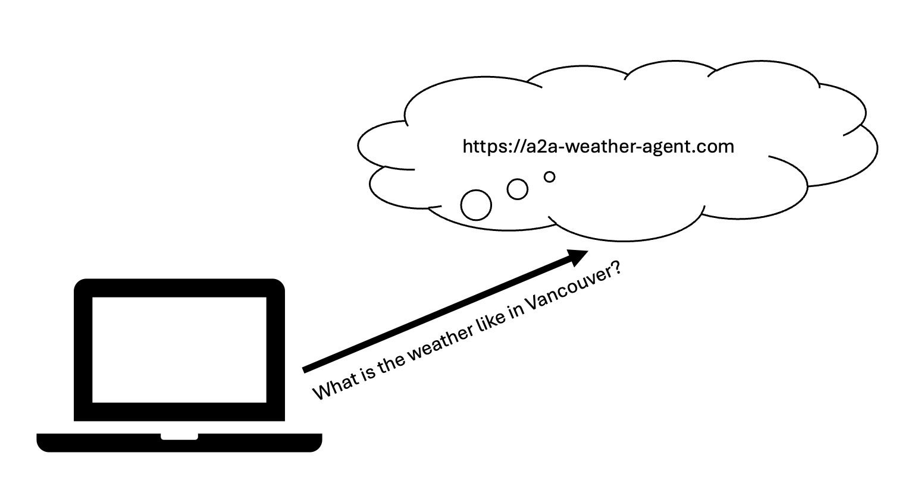

# 2. Client Agnet A2A Integration
## How do we interact with an A2A agent? 

Now, we will build a client agent to interact with the weather agent ([https://a2a-weather.azurewebsites.net/](https://a2a-weather.azurewebsites.net/swagger)). 

We would be able to ask the agent what the weather is like in a particular city.



## Setup

In a new directory, create a new .NET web application with the following terminal window commands:

``` bash
dotnet new web -n '2. Client Agent A2A Integration'

cd '2. Client Agent A2A Integration'
dotnet new gitignore

dotnet add package Azure.AI.OpenAI --version 2.9.0-beta.1
dotnet add package Microsoft.Agents.AI.A2A --version 1.0.0-preview.260402.1
dotnet add package Microsoft.Agents.AI.OpenAI --version 1.0.0
```

Replace `appsettings.Development.json` with this JSON code:

```json
{
    "GitHub": {
        "Token": "put-your-github-personal-access-token-here",
        "ApiEndpoint": "https://models.github.ai/inference",
        "Model": "openai/gpt-4o-mini"
    }
}
```

> [!NOTE]
>
> Replace `put-your-github-personal-access-token-here` with your GitHub Personal Access Token. 

Edit the `.gitignore` file and add to it `appsettings.Development.json` so that your secrets do not find their way into source control by mistake.

## Program.cs

Replace existing code in `Program.cs` with the  following code in sequence.

### Read configuration settings
``` C#
using System.ClientModel;
using System.Text.Json;
using A2A;
using Microsoft.Agents.AI;
using Microsoft.Extensions.AI;
using OpenAI;

// Read configuration settings
var config = new ConfigurationBuilder()
    .SetBasePath(Directory.GetCurrentDirectory())
    .AddJsonFile("appsettings.Development.json", optional: true, reloadOnChange: true)
    .Build();

string? token = config["GitHub:Token"];
string? endpoint = config["GitHub:ApiEndpoint"] ?? "https://models.github.ai/inference";
string? model = config["GitHub:Model"] ?? "openai/gpt-4o-mini";
```

### Initialize chat client
``` C#
// Initialize chat client
var chatClient = new OpenAIClient(
    new ApiKeyCredential(token!),
    new OpenAIClientOptions()
    {
        Endpoint = new Uri(endpoint)
    })
    .GetChatClient(model).AsIChatClient();
```

### Create an agent that uses the weather agent
``` C#
// Connect to the A2A weather agent
A2ACardResolver weatherAgentCardResolver = new A2ACardResolver(new Uri("https://a2a-weather.azurewebsites.net/"));
AIAgent weatherAgent = await weatherAgentCardResolver.GetAIAgentAsync();

// Create a client agent that uses the A2A weather agent as a tool
var agent = chatClient.AsAIAgent(
        name: "Assistant",
        instructions: @"You are a personal weather assistant. 
        You summarize the current weather and the forecast for the next few hours.
        Highlight any significant changes in the weather.
        ", 
        tools: [weatherAgent.AsAIFunction()]);
```

### Send message to agent and stream response

``` C#
// Send message to agent and stream response
var isDebug = false;
var response = agent.RunStreamingAsync("What is the weather like in Vancouver?");
await foreach (var update in response)
{
    foreach (var content in update.Contents)
    {
        if (content is TextContent textContent)
        {
            Console.Write(textContent.Text);
        }
        else if (isDebug && content is FunctionCallContent functionCallContent)
        {                    
            var argsJson = JsonSerializer.Serialize(
                functionCallContent.Arguments,
                new JsonSerializerOptions { WriteIndented = true }
            );
            Console.ForegroundColor = ConsoleColor.DarkGray;
            Console.WriteLine($"\n[Function Call: {functionCallContent.Name}]\nArguments:\n{argsJson}");
        }
        else if (isDebug && content is FunctionResultContent functionResultContent)
        {
            Console.ForegroundColor = ConsoleColor.DarkGray;
            Console.WriteLine($"\n[Function Result: {functionResultContent.Result}]");
        }

    }
}
```

## Run app

In the terminal window:

```bash
dotnet run
```
<details>

<summary>Here's an example of the interaction:</summary>

```json
Currently in Vancouver, it is 10.4°C and feels like 9.4°C. The sky is overcast with a light wind blowing at 6.2 km/h.

For the next few hours:
- At 9:00 AM, the temperature will rise slightly to 10.7°C with partly cloudy skies.
- By 10:00 AM, it will further increase to 11.9°C, still with partly cloudy conditions.
- At 11:00 AM, the temperature will reach 12.9°C and the sky will be mainly clear.

No precipitation is expected, and the weather will gradually become sunnier and warmer over the next few hours.
```

</details>

## Next: [3. A2A Agent Implementation](https://github.com/jasmin-software/dotnet_a2a_workshop/tree/master/3.%20A2A%20Agent%20Implementation)
