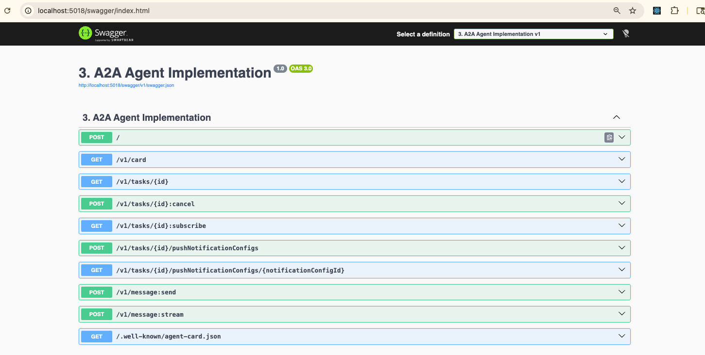
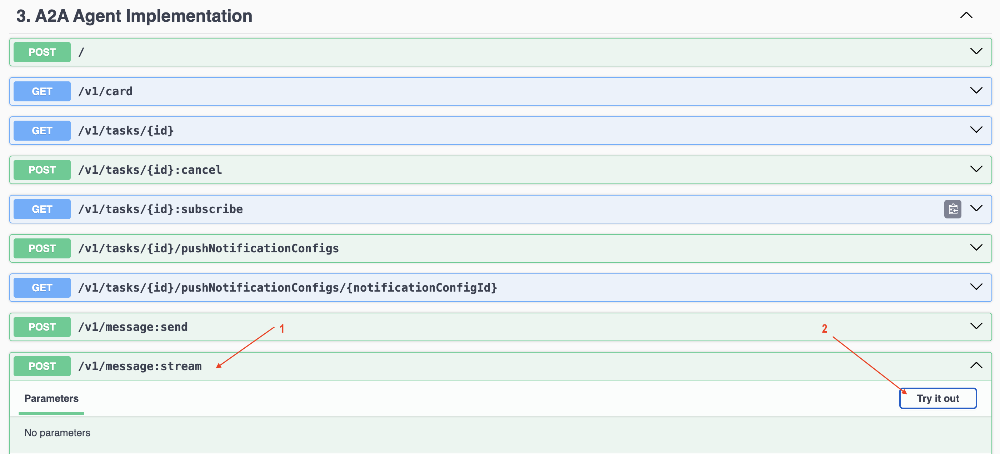
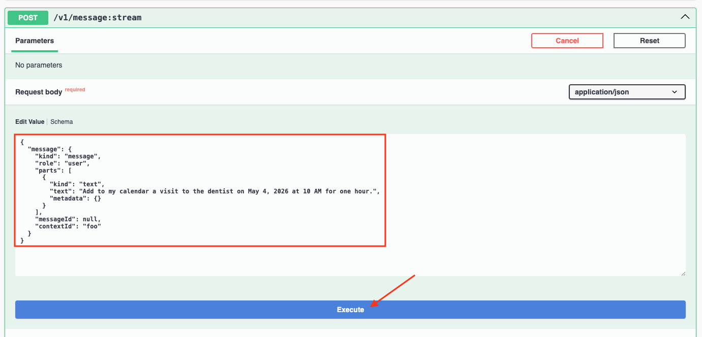
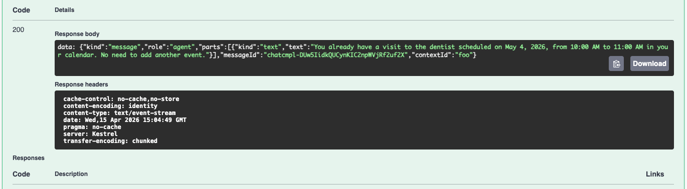

# 3. A2A Agent Implementation

## How do we create our own A2A agent?

In this walkthrough, you will create calendar assistant agent.

We would be able to ask the agent to schedule an event for us, or list our schedule of the day.


## Setup
Create a simple .NET web application with the following terminal window commands:

``` bash
dotnet new web -n '3. A2A Agent Implementation'

cd '3. A2A Agent Implementation'
dotnet new gitignore

dotnet add package Microsoft.Agents.AI.Hosting.A2A.AspNetCore --version 1.0.0-preview.260402.1
dotnet add package Microsoft.AspNetCore.OpenApi --version 10.0.5
dotnet add package Microsoft.Extensions.AI.OpenAI --version 10.4.1
dotnet add package Swashbuckle.AspNetCore --version 10.1.7
mkdir Tools
```

Replace `appsettings.Development.json` with this JSON code:

```json
{
    "GitHub": {
        "Token": "put-your-github-personal-access-token-here",
        "ApiEndpoint": "https://models.github.ai/inference",
        "Model": "openai/gpt-4o-mini"
    }
}
```

> [!NOTE]
>
> Replace `put-your-github-personal-access-token-here` with your GitHub Personal Access Token. 

Edit the `.gitignore` file and add to it `appsettings.Development.json` so that your secrets do not find their way into source control by mistake.

## Tools

Create the following C# class files in the `Tools` folder:

### CalendarEvents.cs

```C#
namespace A2AAgent.Tools;

public sealed class CalendarEvent {
    public required string Id { get; set; }
    public required string Title { get; set; }
    public required DateTime Start { get; set; }
    public required DateTime End { get; set; }
    public string? Location { get; set; }
    public string? Description { get; set; }
}
```

### ICalendarStore.cs

```c#
namespace A2AAgent.Tools;

public interface ICalendarStore {
    IReadOnlyList<CalendarEvent> GetEvents(DateOnly date);
    void AddEvent(CalendarEvent calendarEvent);
}
```

### InMemoryCalendarStore.cs

```C#
namespace A2AAgent.Tools;

public sealed class InMemoryCalendarStore : ICalendarStore {
    private readonly List<CalendarEvent> _events =
    [
        new CalendarEvent {
            Id = Guid.NewGuid().ToString(),
            Title = "Work",
            Start = new DateTime(2026, 4, 21, 9, 0, 0),
            End = new DateTime(2026, 4, 21, 17, 0, 0),
            Location = "Office"
        },
        new CalendarEvent {
            Id = Guid.NewGuid().ToString(),
            Title = "Commute to BCIT Downtown Campus",
            Start = new DateTime(2026, 4, 21, 17, 0, 0),
            End = new DateTime(2026, 4, 21, 18, 0, 0),
            Location = "Train"
        },
        new CalendarEvent {
            Id = Guid.NewGuid().ToString(),
            Title = "Workshop: Agent-to-Agent (A2A) with Microsoft Agent Framework",
            Start = new DateTime(2026, 4, 21, 18, 0, 0),
            End = new DateTime(2026, 4, 21, 20, 0, 0),
            Location = "BCIT Downtown Campus, Room 645"
        },
        new CalendarEvent {
            Id = Guid.NewGuid().ToString(),
            Title = "Sleep",
            Start = new DateTime(2026, 4, 21, 23, 0, 0),
            End = new DateTime(2026, 4, 22, 7, 0, 0),
            Location = "Bedroom"
        },
        new CalendarEvent {
            Id = Guid.NewGuid().ToString(),
            Title = "Work",
            Start = new DateTime(2026, 4, 22, 9, 0, 0),
            End = new DateTime(2026, 4, 22, 17, 0, 0),
            Location = "Office"
        },
        new CalendarEvent {
            Id = Guid.NewGuid().ToString(),
            Title = "Create my own A2A agent!",
            Start = new DateTime(2026, 4, 22, 19, 0, 0),
            End = new DateTime(2026, 4, 22, 20, 0, 0),
            Location = "Home"
        },
        new CalendarEvent {
            Id = Guid.NewGuid().ToString(),
            Title = "Sleep",
            Start = new DateTime(2026, 4, 22, 23, 0, 0),
            End = new DateTime(2026, 4, 23, 7, 0, 0),
            Location = "Bedroom"
        }
    ];

    public IReadOnlyList<CalendarEvent> GetEvents(DateOnly date) {
        return _events
            .Where(e => DateOnly.FromDateTime(e.Start) == date)
            .ToList();
    }

    public void AddEvent(CalendarEvent calendarEvent) {
        _events.Add(calendarEvent);
    }
}
```

### CalendarTool.cs

The `CalendarTool` has the smarts to carry out two related tasks. It can:
- Get all events on a specific date
- Create an event with a given event title, start time, end time (and optionally event location and event description)

```C#
using System.ComponentModel;

namespace A2AAgent.Tools;

internal static class CalendarTool {
    private static ICalendarStore _calendarStore = new InMemoryCalendarStore();

    public static void Initialize(ICalendarStore calendarStore) {
        _calendarStore = calendarStore;
    }

    [Description("Get calendar events for a given date in yyyy-MM-dd format.")]
    public static string GetEventsOnDate(
        [Description("Date in yyyy-MM-dd format")] string date) {
        if (!DateOnly.TryParse(date, out var parsedDate)) {
            return "Invalid date. Please provide the date in yyyy-MM-dd format.";
        }

        var events = _calendarStore.GetEvents(parsedDate);

        if (events.Count == 0) {
            return $"No events found on {parsedDate:yyyy-MM-dd}.";
        }

        var lines = events
            .OrderBy(e => e.Start)
            .Select(e => $"- {e.Title}: {e.Start:yyyy-MM-dd HH:mm} to {e.End:yyyy-MM-dd HH:mm}");

        return string.Join(Environment.NewLine, lines);
    }

    [Description("Create a calendar event.")]
    public static string CreateEvent(
        [Description("Event title")] string title,
        [Description("Start time in ISO format, for example 2026-04-10T14:00:00")] string start,
        [Description("End time in ISO format, for example 2026-04-10T15:00:00")] string end,
        [Description("Optional event location")] string? location = null,
        [Description("Optional event description")] string? description = null)
    {
        if (!DateTime.TryParse(start, out var startTime)) {
            return "Invalid start time. Use ISO format like 2026-04-10T14:00:00.";
        }

        if (!DateTime.TryParse(end, out var endTime)) {
            return "Invalid end time. Use ISO format like 2026-04-10T15:00:00.";
        }

        if (endTime <= startTime) {
            return "End time must be after start time.";
        }

        var calendarEvent = new CalendarEvent {
            Id = Guid.NewGuid().ToString(),
            Title = title,
            Start = startTime,
            End = endTime,
            Location = location,
            Description = description
        };

        _calendarStore.AddEvent(calendarEvent);

        return
            $"Created event '{calendarEvent.Title}' from " +
            $"{calendarEvent.Start:yyyy-MM-dd HH:mm} to {calendarEvent.End:yyyy-MM-dd HH:mm}.";
    }
}
```
## Program.cs
Replace `Program.cs` with the following code in sequence.

### Read configuration settings
``` C#
using A2A;
using A2A.AspNetCore;
using Microsoft.Extensions.AI;
using OpenAI;
using A2AAgent.Tools;

var builder = WebApplication.CreateBuilder(args);
builder.Services.AddSingleton<ICalendarStore, InMemoryCalendarStore>();
builder.Services.AddOpenApi();
builder.Services.AddSwaggerGen();

// Read configuration settings
string githubToken = builder.Configuration["GitHub:Token"]
    ?? throw new InvalidOperationException("GitHub:Token is not set.");
string endpoint = builder.Configuration["GitHub:ApiEndpoint"] ?? "https://models.github.ai/inference";
string model = builder.Configuration["GitHub:Model"] ?? "openai/gpt-4o-mini";
```

### Initialize chat client and agent
``` C#
// Initialize chat client
IChatClient chatClient = new OpenAIClient(
    new System.ClientModel.ApiKeyCredential(githubToken),
    new OpenAIClientOptions
    {
        Endpoint = new Uri(endpoint),
    })
    .GetChatClient(model).AsIChatClient();

// Create agent
var calendarAgent = chatClient.AsAIAgent(
    name: "calendar",
    instructions:
    """
    You are a calendar assistant.
    You list calendar events given a date, and you create new events with 
    a title, start time, end time, and optional location and description.

    Rules:
    - When the user asks what is on a day, use the GetEventsOnDate tools.
    - If a user wants to create an event, gather title, start time, and end time if missing, 
      and use the CreateEvent tool.
    - Do not create the event if there is already an event that overlaps with the requested time.
    - Keep responses concise and helpful.
    - Always confirm created events with the exact time.

    - Today is 2026-04-21.
    """,
    tools: [
        AIFunctionFactory.Create(CalendarTool.GetEventsOnDate),
        AIFunctionFactory.Create(CalendarTool.CreateEvent)
    ]
);
builder.Services.AddSingleton(chatClient);

var app = builder.Build();

app.MapOpenApi();
app.UseSwagger();
app.UseSwaggerUI();
```

### Customize agent card
``` C#
// Customize agent card
AgentCard calendarAgentCard = new AgentCard {
    Name = "Calendar Agent",
    Description = "A calendar assistant that can list and create events for a particular date.",
    Version = "1.0.0",
    Skills = [
        new AgentSkill {
            Id = "get-events",
            Description = "Get calendar events for a given date in yyyy-MM-dd format.",
            Tags = ["calendar", "events", "date"],
            Examples = [
                "What events do I have on 2026-04-21?",
                "Do I have any meetings on April 21, 2026?"
            ]
        },
        new AgentSkill {
            Id = "create-event",
            Description = "Create a calendar event with title, start time, end time, and optional location and description.",
            Tags = ["calendar", "create", "event"],
            Examples = [
                "Create a calendar event titled 'Team Meeting' on April 21, 2026 from 2 PM to 3 PM.",
                "I have a meeting from 10 AM to 11 AM on April 21, 2026. Can you add it to my calendar?"
            ]
        }
    ]
};
```

### Expose agent via A2A protocol
``` C#
// Expose agent via A2A protocol
app.MapA2A(
    calendarAgent, 
    path: "/", 
    agentCard: calendarAgentCard,
    taskManager => app.MapWellKnownAgentCard(taskManager, "/"));

app.Run();
```
### Making Swagger UI the default landing page

Open `Properties/launchSettings.json` in your editor and make the following changes:

Add the following inside the `http` and `https` blocks:

```json
"launchUrl": "swagger"
```

## Run app

In the terminal window:

```bash
dotnet watch
```

The web app will automatically open in your browser at address `/swagger/index.html` with an interface that looks like this:



### Test your app

Choose the GET `/v1/message:stream` endpoint. Then, click on the `Try it out` button.



Enter the following JSON then click on `Execute`:

```json
{
  "message": {
    "kind": "message",
    "role": "user",
    "parts": [
      {
        "kind": "text",
        "text": "Schedule a visit to the dentist on May 4, 2026 at 10 AM for one hour.",
        "metadata": {}
      }
    ],
    "messageId": null,
    "contextId": "foo"
  }
}
```



The response from the agent will display.



Go ahead and change the `text` field in the `Request body` and ask the agent your schedule for May 4, 2026.

## Next: [4. Multi-Agent Coordination](https://github.com/jasmin-software/dotnet_a2a_workshop/blob/master/4.%20Multi-Agent%20Coordination/README.md)